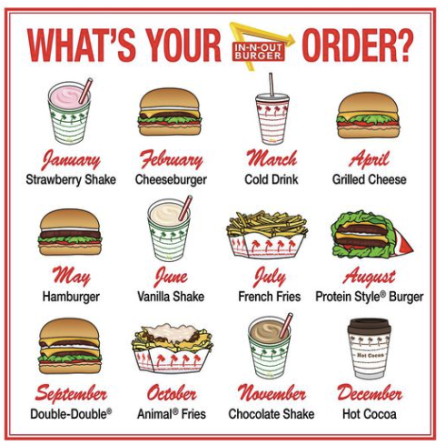
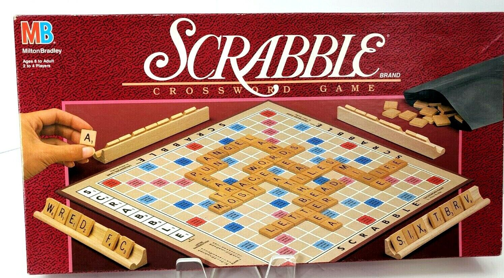

# Project Imitation

- [Jump to Getting Started](./.lesson/part2.md)

Note, if you're having trouble running the project, try opening a "Terminal" below and typing:

```sh
npm start
```

## Project Description

For this project, you must recreate a print layout in HTML and CSS.

- Elements you will need to pay attention to and copy:
- Positioning of Elements
- Color
- Font (family, weight, style)
- Images (positioning, relation to other images, etc. — you don't need the exact images copied)

## Part 0: Pick a Print Design

Pick a print layout worthy of copying. Your layout should contain at least 4 distinct layout elements with a significant degree of complexity. For example, do not simply pick a layout which contains 4 pieces of text all of which are perfectly centered on the page. Upload a copy of your image into your repl.it so I can refer to it when I grade your project.

### Example 1: Clearly Complex

Here's an example of a suitably complex design:

This contains a grid of items, each of which has three pieces (image, month, title) and also a title, and finally the logo itself, which is built out of an arrow, a square, and text.

### Example 2: Probably too easy


This ACDC album cover is probably too straightforward. If a student committed to creating the fade effect on "Black Ice" in pure CSS and brought in the borders behind "Black Ice" as unique elements, they could probably convince me this project would be challenging enough, but I'd usually advise they find a different layout to work with.

### Example 3: Surprisingly Challenging!


This scrabble box probably looks too simple at first, but it's actually plenty complex, with the "R" from "Scrabble" overlapping the word "Crossword game" and the placement of "Brand" and "Scrabble" over the underline presenting a challenge. In addition, you've got the way the hands and the scrabble bag overlap the pink-outlined box in the background and the board to contend with. In short, this is a legitimately challenging design!

### How to find your own design?

I recommend you try some google image searches with specific items you find interesting.

For example, I might search Goolge Images for "magazine cover gravel bike" or "life cereal box." Your goal is to find something that was created for _print_ first, so I recommend things like: book jackets, magazine covers, food labels, game boxes, album covers, or posters. If your design relies on a single image, much of your success will depend on you re-creating that image, so I recommend trying to find designs that make ample use of text, or that use images in ways you can easily imitate.

## Part 1: Pixel-for-Pixel Copy

1. Create a basic mock-up of the layout. Fix the size of your layout so that you can create a pixel-perfect representation of the print layout you copied. Your web layout should be the same dimensions as your print layout.
2. Match color, font, images, and alignments as closely as possible until you've created a pixel-perfect representation.
3. Be thoughtful in using the correct layout for each item: where is the box model adequate? Where is flexbox or grid better? Where do you need absolute positioning to layer items on top of one another?

## Part 2: Responsive Adaptation

1. Create a copy of your pixel-perfect layout and REMOVE the container which fixes the size of the layout.
1. Create a responsive layout which works well in at least 3 sizes: full browser width, tablet size, and phone layout. You may have to change significant parts of the layout to make the new design responsive.
1. Pay attention to what you were able to keep and what you were able to lose from the original design as you moved from print to responsive web design. Specifically, pay attention to the key elements of design we have studied:

- _Contrast_: What elements stand out as different? How did the designer create contrast and draw attention to key elements on the page?
- _Repetition_: What elements repeat? How did the designer create a sense of unity and rhythm to the page?
- _Alignment_: What are the strong alignments on the page? Where are alignments broken?
- _Grouping_: What elements are grouped together? How are those groupings meaningful?

### Honors Credit

For honors credit, you will want to add **animation** to your responsive adaptation to emphasize the fact that this is a web project and not a print one. Pick elements from the original and let them transition into place slowly using transforms.

To do so, you can learn to use keyframes. Here are some tutorials:

- [Keyframes tutorial](https://www.joshwcomeau.com/animation/keyframe-animations/)
- [W3 Schools Overview](https://www.w3schools.com/css/css3_animations.asp)
